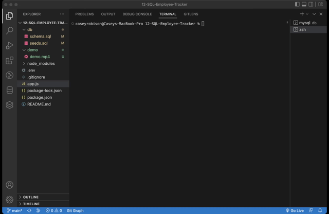

# 12-SQL-Employee-Tracker

# Description
A terminal application that utilizes SQL and NODE to give user the ability to track and manage their employees by department, role, and individual. 
# Table of Contents 
* [Installation](#installation)
* [Usage](#usage)
* [Demo](#demo)
* [GitHub](#github)
# Installation
The following necessary dependencies must be installed to properly run the application:

[Inquirer](https://www.npmjs.com/package/inquirer)  
[MySQL2](https://www.npmjs.com/package/mysql2)  
[Figlet](https://www.npmjs.com/package/figlet)  
[Console.Table](https://www.npmjs.com/package/console.table)  
[Dotenv](https://www.npmjs.com/package/dotenv)

# Usage
 Install all dependenices, then run MySql to engage the database. Type NPM start to run.
# Demo
[Video Showing Use](https://www.dropbox.com/s/cs3ru0zh436czkm/employee-tracker-demo.mp4?dl=0)

# GitHub

[Github Repo](https://www.github.com/mrcaseyrobison/12-SQL-Employee-Tracker/)